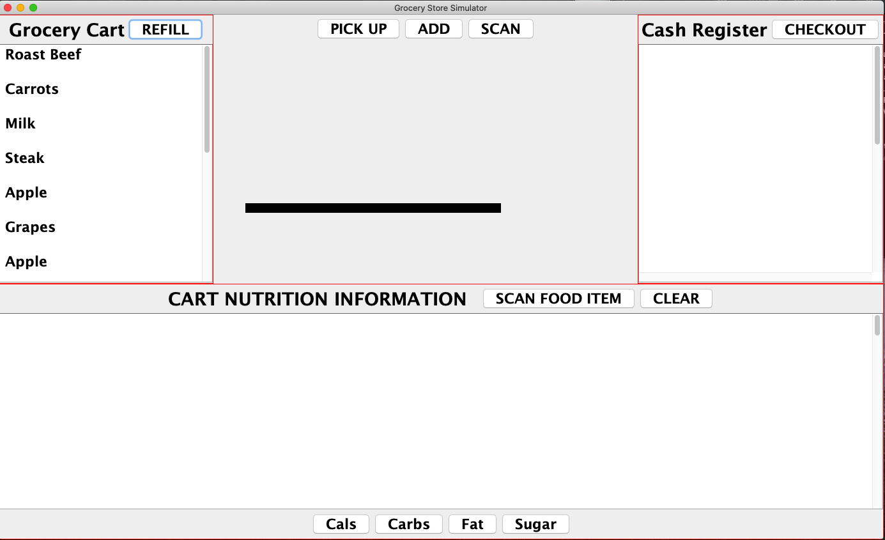

# groceryGUI

GUI using the JFrame library that simulates an interface used at a grocery store to sell items. Reads pricing and nutritional info from groceryItems.txt and nutrition.txt files respectively. 

Compile all java files, then run the GroceryStoreViewer program.

Demo:

